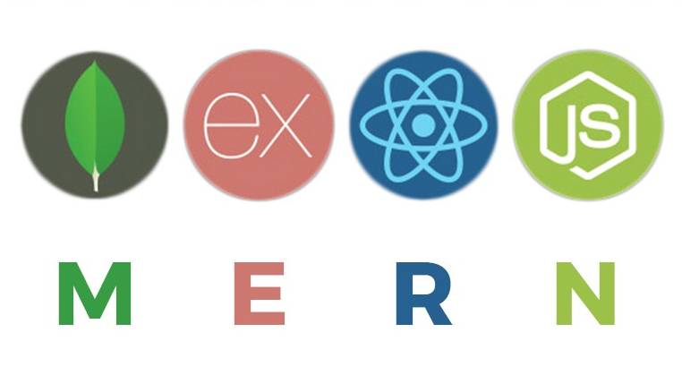

<!--
*** Thanks for checking out the Best-README-Template. If you have a suggestion
*** that would make this better, please fork the repo and create a pull request
*** or simply open an issue with the tag "enhancement".
*** Thanks again! Now go create something AMAZING! :D
***
***
***
*** To avoid retyping too much info. Do a search and replace for the following:
*** github_username, repo_name, twitter_handle, email, project_title, project_description
-->

<!-- PROJECT SHIELDS -->
<!--
*** I'm using markdown "reference style" links for readability.
*** Reference links are enclosed in brackets [ ] instead of parentheses ( ).
*** See the bottom of this document for the declaration of the reference variables
*** for contributors-url, forks-url, etc. This is an optional, concise syntax you may use.
*** https://www.markdownguide.org/basic-syntax/#reference-style-links
-->

[![Contributors][contributors-shield]][contributors-url]
[![Forks][forks-shield]][forks-url]
[![Stargazers][stars-shield]][stars-url]
[![Issues][issues-shield]][issues-url]
[![MIT License][license-shield]][license-url]
[![LinkedIn][linkedin-shield]][linkedin-url]

<!-- PROJECT LOGO -->
<br />
<p align="center">
  <a href="https://github.com/luke-pritch/proshop">
    
  </a>

  <h3 align="center">ProShop</h3>

  <p align="center">
    Full Stack E-commerce Store 
    <!-- <br /> -->
    <!-- <a href="https://github.com/luke-pritch/proshop"><strong>Explore the docs »</strong></a> -->
    <!-- <br /> -->
    <br />
    <!-- <a href="https://github.com/luke-pritch/proshop">View Demo</a>
    · -->
    <a href="https://github.com/luke-pritch/proshop/issues">Report Bug</a>
    ·
    <a href="https://github.com/luke-pritch/proshop/issues">Request Feature</a>
  </p>
</p>

<!-- TABLE OF CONTENTS -->
<details open="open">
  <summary><h2 style="display: inline-block">Table of Contents</h2></summary>
  <ol>
    <li>
      <a href="#about-the-project">About The Project</a>
      <ul>
        <li><a href="#built-with">Built With</a></li>
      </ul>
    </li>
    <li>
      <a href="#getting-started">Getting Started</a>
      <ul>
        <li><a href="#prerequisites">Prerequisites</a></li>
        <li><a href="#installation">Installation</a></li>
      </ul>
    </li>
    <li><a href="#usage">Usage</a></li>
    <li><a href="#roadmap">Roadmap</a></li>
    <li><a href="#contributing">Contributing</a></li>
    <li><a href="#license">License</a></li>
    <li><a href="#contact">Contact</a></li>
    <!-- <li><a href="#acknowledgements">Acknowledgements</a></li> -->
  </ol>
</details>

<!-- ABOUT THE PROJECT -->

## About The Project

<!-- [![Product Name Screen Shot][product-screenshot]](https://example.com) -->

<!-- Here's a blank template to get started:
**To avoid retyping too much info. Do a search and replace with your text editor for the following:**
`github_username`, `repo_name`, `twitter_handle`, `email`, `project_title`, `project_description` -->

This is an example eCommerce store using full stack MERN and TypeScript. Built out here from scratch to be used by myself or anyone interested in spinning up custom eCommerce stores without the need of something like squarespace or shopify. A educational exercise for myself.

### Built With

- [MongoDB](https://www.mongodb.com/)
- [Express](https://expressjs.com/)
- [React](https://reactjs.org/)
- [Node.js](https://nodejs.org/en/)
- [React-Bootstrap](https://react-bootstrap.github.io/)
- [TypeScript](https://www.typescriptlang.org/)

<!-- GETTING STARTED -->

## Getting Started

To get a local copy up and running follow these simple steps.

### Prerequisites

This is an example of how to list things you need to use the software and how to install them.

- npm
  ```sh
  npm install npm@latest -g
  ```

### Installation

1. Clone the repo
   ```sh
   git clone https://github.com/luke-pritch/proshop.git
   ```
2. Install NPM packages in both the back end and front end
   ```sh
   cd backend && npm install
   cd ../frontend && npm install
   ```

<!-- USAGE EXAMPLES -->

## Usage

More details will be added here as the project is still in active development.

<!-- Use this space to show useful examples of how a project can be used. Additional screenshots, code examples and demos work well in this space. You may also link to more resources.

_For more examples, please refer to the [Documentation](https://example.com)_ -->

<!-- ROADMAP -->

## Roadmap

See the [open issues](https://github.com/luke-pritch/proshop/issues) for a list of proposed features (and known issues).

<!-- CONTRIBUTING -->

## Contributing

Contributions are what make the open source community such an amazing place to be learn, inspire, and create. Any contributions you make are **greatly appreciated**.

1. Fork the Project
2. Create your Feature Branch (`git checkout -b feature/AmazingFeature`)
3. Commit your Changes (`git commit -m 'Add some AmazingFeature'`)
4. Push to the Branch (`git push origin feature/AmazingFeature`)
5. Open a Pull Request

<!-- LICENSE -->

## License

Distributed under the MIT License. See `LICENSE` for more information.

<!-- CONTACT -->

## Contact

Luke Pritchard - lp@lukepritchard.ca

Project Link: [https://github.com/luke-pritch/proshop](https://github.com/luke-pritch/proshop)

<!-- ACKNOWLEDGEMENTS -->
<!--
## Acknowledgements

- []()
- []()
- []() -->

<!-- MARKDOWN LINKS & IMAGES -->
<!-- https://www.markdownguide.org/basic-syntax/#reference-style-links -->

[contributors-shield]: https://img.shields.io/github/contributors/luke-pritch/proshop.svg?style=for-the-badge
[contributors-url]: https://github.com/luke-pritch/proshop/graphs/contributors
[forks-shield]: https://img.shields.io/github/forks/luke-pritch/proshop.svg?style=for-the-badge
[forks-url]: https://github.com/luke-pritch/proshop/network/members
[stars-shield]: https://img.shields.io/github/stars/luke-pritch/proshop.svg?style=for-the-badge
[stars-url]: https://github.com/luke-pritch/proshop/stargazers
[issues-shield]: https://img.shields.io/github/issues/luke-pritch/proshop.svg?style=for-the-badge
[issues-url]: https://github.com/luke-pritch/proshop/issues
[license-shield]: https://img.shields.io/github/license/luke-pritch/proshop.svg?style=for-the-badge
[license-url]: https://github.com/luke-pritch/proshop/blob/master/LICENSE.txt
[linkedin-shield]: https://img.shields.io/badge/-LinkedIn-black.svg?style=for-the-badge&logo=linkedin&colorB=555
[linkedin-url]: https://linkedin.com/in/luke-pritch
